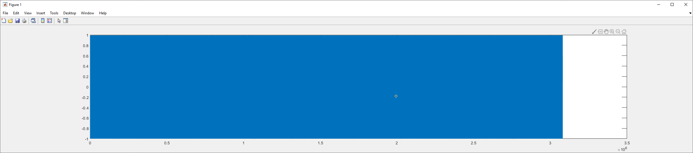
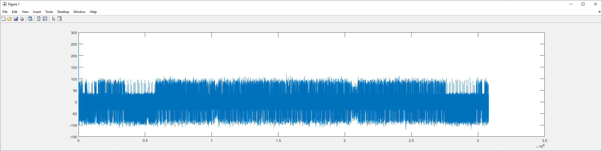

# Quick Solution

Based on the title and description, we were able to guess that this challenge likely has to do with DSSS, and the chip length is probably 1024 or some factor of 1024.

In DSSS, each bit of a datastream is encoded by multiplying it by a pseudo-random sequence, which makes the datastream look like noise. You can only pull the data back out if you know the original sequence.

In "the real world", there are likely multiple transmitters transmitting on the same frequency with different sequences, but in this challenge it's reasonable to assume there's just one. If there's just one sequence, then we don't actually need to know what the encoding sequence is - just the length of the sequence. We can use any chip of the data to differentially decode any other chip of the data by using an autocorrelation.

We can guess the length of the chirp until we get it right, because there are only a few possibilities. It turns out the chip length is 512.

Original Data:


Data after autocorrelating with the first 512 samples:


It's evident that this technique successfully brought some order out of the entropy

Now, to recover the data all we need to do is look at every 512'th sample. If it's negative, that's a zero and otherwise it's a one.

Entire solution in matlab:
```Matlab
[y, Fs] = audioread('challenge.wav');

samples = y(:,2)';
result = conv(samples,flip(samples(1:512)));
bits = (sign(result(512:512:end))+1)/2;
```

Plugging the bits from matlab into CyberChef, we get the following output:
```
.PNG
.
...
IHDR.......@.....õ]©¾...·IDATxÚíÝÝ®¢0..P9áý_¹seB..».Pt.»ñ ÔMûÑ....Rz.?éO	@........... ......@........... ......@........... .....³¶¼yY.ÿ^K)e_/Ùîè·JÞïùܦe_gï©ÙwiÍ.¶»ë·[.e9.ÅQÛkÎcÉ>Jë]º¯h?.qì½ú÷®ÕÚRÔ\çØë4{.+iôYAj:côø½:â^.·¯o·.tÂ..¡gH½.ÓúÙ[ëXÒ.{.»¦.%ík^.ä..RzÍöKc3µ'.B3Öñè..Îðj:jm{ïªã¬ç°y.pÕÉë}2®hwdz<ú*¹½.ìµ%÷ÞYÎié´·×ù.©E¯:.¼¿w?^_?.:h϶;[ú..p¹¥CnJ.[..ý»Ç:970..S2øsK¦.u,
.+.=â"¶Î6.¯¾.E×y5ëÁÜÔþs ¶|ÞÜþsí:.)Ô\E¯.éD.AË:{o.W,1K.=j.{{..¾ËY³¦ý,vt»h;Ï®ÎOXREÛ¿.ÓÕW·o.¡Fj³
Âh-×'u¸.;ÉÞ.4..3Ý鯽¿2j68*ü¿±¾5ãc.mÐ.NÈÕíÍÝ.ûå+\¤ÏD..þª.cî¯ePå^.íjvÔ.½Ï.ù"PÍ.¨£+ÜÝu.t°.ö÷ê¼¹+bK
{ïoÔ±GÍ.×Ú.ï5öÎÄ.mOäæXt»³mÞ.¯yê0b.\óT"Z¯«.ÎÙw.Îê8ê.hïc..	,éAs,SBuÔ7úÖÀ..â..}.eÔ7xÔ..j.sð}fY.Ì..U_äJF.ü,K........ ......@........... ......@........... ......@..ãü..CjPzñ¿¾....IEND®B`..
```

Saving as a PNG, we get the flag

