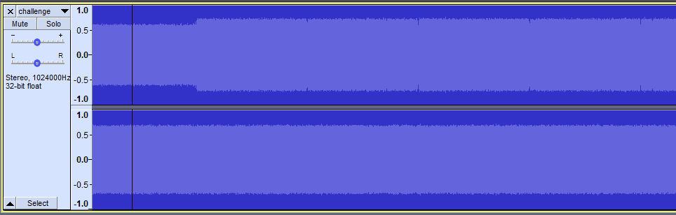
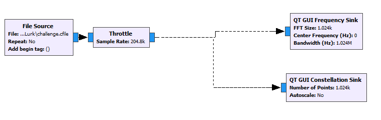
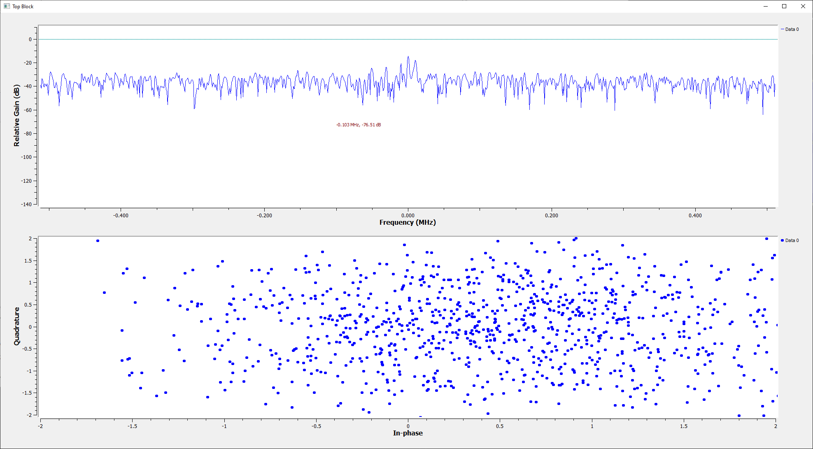
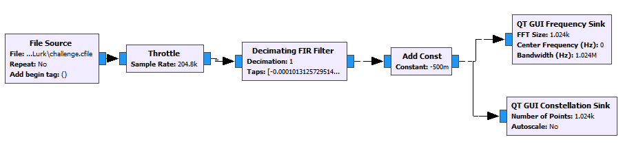
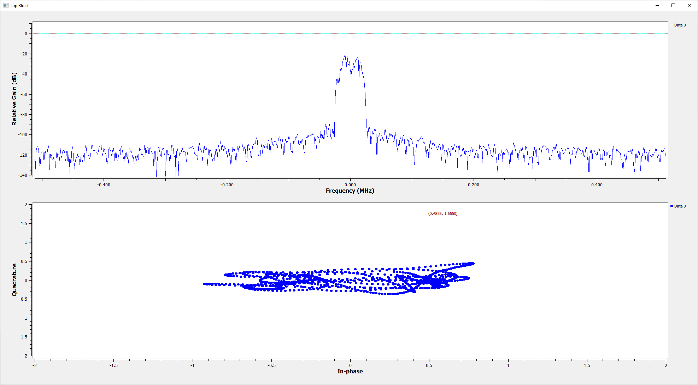
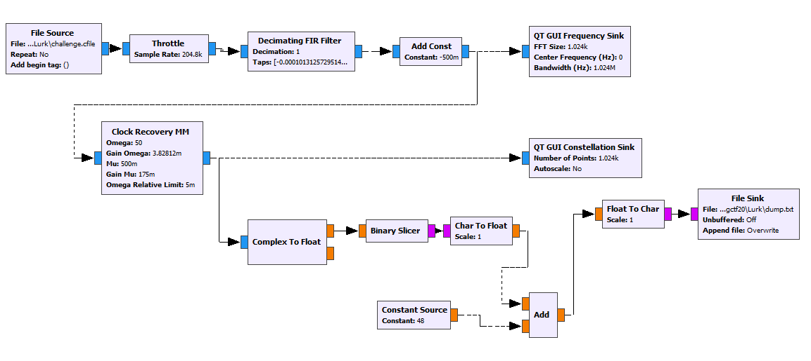
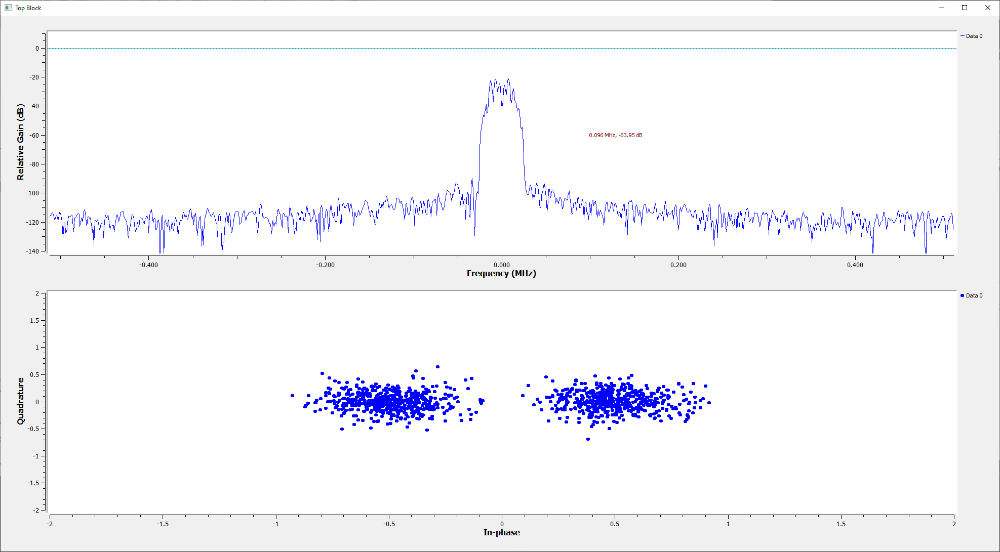
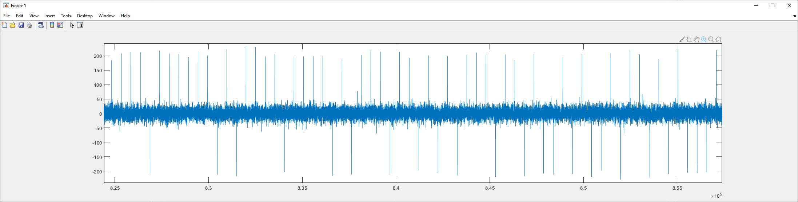
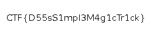

# WHAT LURKS BELOW

_Challenge Description: This one seems to be straight forward, but there is no flag to be found! Sample rate = 1024k_


## Initial Thoughts
Immediately after reading the description of the problem, I thought of GPS satellites. The GPS signal is so weak that it is typically below the noise floor of the receivers (What lurks below!), so I'm suspicious that this problem will have a similar theme.

GPS satellites encode their data using a technique called [DSSS](https://en.wikipedia.org/wiki/Direct-sequence_spread_spectrum#:~:text=In%20telecommunications%2C%20direct%2Dsequence%20spread,to%20reduce%20overall%20signal%20interference.&text=With%20DSSS%2C%20the%20message%20bits,known%20as%20a%20spreading%20sequence.). 
The technique involves multiplying each bit by a long sequence of pseudo-random bits before transmission. The receiver can then correlate this seemingly-noise signal with the same sequence and pull it out from below the noise floor


### Getting started

We're given [challenge.cfile](files/challenge.cfile) and nothing else. cfile is a common format for storing complex radio signals - to make it a bit easier to process I quickly passed it through a very simple GNURadio flowgraph to produce a wav file representing the raw input ([challenge.wav](files/challenge.wav))

Looking at this wav file, we can see what appears to be a lot of random noise on both channels, with a small hint of a signal on the I channel:


Armed with the insight that this is probably DSSS, we can **[skip most of the work](QuickSolution.md)**, but that's not how we originally solved it, though I wish it was.  
  <br />


### Decoding the I channel signal  

This is probably a digital radio problem, so I broke out GNURadio to solve it. I start with a frequency sink and constellation sink to see if I can find any pattern to the data:  



_... Nope_

At best I can see perhaps a little bit of data in the <25MHz range, but nothing obvious and definitely no constellation. We'll have to filter some of this noise




After adding my best guess at a relevant filter, we get something much more promising - this looks like a BPSK constellation! That's great news, because BPSK is very easy to decode.

I threw on a Clock Recovery Block to get a an acceptable constellation, and some additional garbage to make it output a string of ones and zeros to a text file. This flowgraph really isn't very good and produces some bit errors, but the sequence repeats several times so I was able to use that as a rudimentary error correction code, and fix the bit errors in a text editor.



The resultant bitstream looks like this:
```
00000000000000000000000000000000000000000000000000000000000000000000000000000000000000000000000000010101010
00000000000000001001101001101001101001101001010110010101100101101001011010011001101001101010101010010101101001011001010110011010100101101010100110010101101001101001010110011010100101101001100110010110100110101010011010101010100101011001101010010110011010101001011010011001101001101010101010010101100110101001010110100110100101101010100110010110010101101001010110100101100101101001011010010110100110011001010110100110101001101010101010100110011010101001010110100101100101101010100110010110010110011001010110101010100101100101101010010110100110011010011010101010100101011010011010010110101010011001010110011010100101101001100110100110101010101010010101011001101001101010101010100101101010011010010110101010101001011010011010100101100110101001011001100101101001100110100110100110010101101010011010101010100110011001101010010110011010101001011010011001101001101010101010010110101001011001011001101010100101100110100110010101101010101010011010101010100101011010010110010110100110011001010110101001100101011001100110010110100110011001011001010110100101101010010110010110100110011010011010101010100101100110100110010101101001011010010101100110101001101010101010101010011001100110101010101010101010100101101001100101100110101001101010101001010110011001101001101001101001011001010110101010011001010110101010100101011010101001011001011010011001010110011010101010010101101010010110010110010110101010101001101001100110100110100101100110010110100101011001010101100110101010011010100110010110011010010110101010010110101010100110011001010101011010100101101010011010011001010110010110011010101010100110100101100101010101101001010110010110010101011001010110101010010101100101011001011001100110010110011010101001101001011010010101010110100101011010101001101010101010101010011001100110100101100101101010100101010110101001010101100101010110101001101010010110101001101010101001100110010110101010010110101010010101011001101001011010011010011001010101100110011001011001100110101010010110010110010110100101101010010110100110100110100101100101010110011001100101011001100101100101010101010101010110011001101001100110010110010101011001011001011010010101011010100101101001011001011001011010101001100101101010011001100101101010100110011010101010
00000000000000001001101001101001101001101001010110010101100101101001011010011001101001101010101010010101101001011001010110011010100101101010100110010101101001101001010110011010100101101001100110010110100110101010011010101010100101011001101010010110011010101001011010011001101001101010101010010101100110101001010110100110100101101010100110010110010101101001010110100101100101101001011010010110100110011001010110100110101001101010101010100110011010101001010110100101100101101010100110010110010110011001010110101010100101100101101010010110100110011010011010101010100101011010011010010110101010011001010110011010100101101001100110100110101010101010010101011001101001101010101010100101101010011010010110101010101001011010011010100101100110101001011001100101101001100110100110100110010101101010011010101010100110011001101010010110011010101001011010011001101001101010101010010110101001011001011001101010100101100110100110010101101010101010011010101010100101011010010110010110100110011001010110101001100101011001100110010110100110011001011001010110100101101010010110010110100110011010011010101010100101100110100110010101101001011010010101100110101001101010101010101010011001100110101010101010101010100101101001100101100110101001101010101001010110011001101001101001101001011001010110101010011001010110101010100101011010101001011001011010011001010110011010101010010101101010010110010110010110101010101001101001100110100110100101100110010110100101011001010101100110101010011010100110010110011010010110101010010110101010100110011001010101011010100101101010011010011001010110010110011010101010100110100101100101010101101001010110010110010101011001010110101010010101100101011001011001100110010110011010101001101001011010010101010110100101011010101001101010101010101010011001100110100101100101101010100101010110101001010101100101010110101001101010010110101001101010101001100110010110101010010110101010010101011001101001011010011010011001010101100110011001011001100110101010010110010110010110100101101010010110100110100110100101100101010110011001100101011001100101100101010101010101010110011001101001100110010110010101011001011001011010010101011010100101101001011001011001011010101001100101101010011001100101101010100110011010101010
... Repeats a dozen times
```

Note that the data contains a balanced number of ones and zeros - this indicates it's probably manchester-coded. Passing the result through an online manchester decoder produces the following ascii:
```
I've started the transfer (sample rate = 1024k). The chip sequence is: 
�´AÔ�p¸8lº6À��Îô"Óñ�v�7ÎÞáÝ«BgÎM��x�AXaé�õjf2MêëêVö϶+
```
The bit after the ascii is 64 bytes:
```
80 0C B4 41 D4 93 70 B8 38 6C BA 0E 36 C0 94 9A CE F4 22 D3 0C 15 F1 89 76 81 37 CE DE E1 DD AB 42 67 CE 10 05 4D 87 8F 78 8C 41 58 61 E9 92 F5 6A 1B 66 32 4D EA EB 7F EA 56 F6 CF 19 B6 16 2B
```

At this point we stalled out a bit. For some reason we forgot the GPS/DSSS insight for about an hour while we tried to pull the flag out of this data. Nothing we did worked, though, and eventually we remembered the name of the challenge and got back on track.

The flag isn't in this sequence. The flag is in the original file, and this is the pseudo-random sequence that was used to encode the data into chips.

If we go back to the original data and correlate it with our newly found chip, we get the following:


There's a positive or negative spike every 512 samples - just as expected! All that's left is to grab each of these bits and convert it to ascii

Matlab script:
```Matlab
[y, Fs] = audioread('challenge.wav');

samples = y(:,2)';

chip = [1,0,0,0,0,0,0,0,0,0,0,0,1,1,0,0,1,0,1,1,0,1,0,0,0,1,0,0,0,0,0,1,1,1,0,1,0,1,0,0,1,0,0,1,0,0,1,1,0,1,1,1,0,0,0,0,1,0,1,1,1,0,0,0,0,0,1,1,1,0,0,0,0,1,1,0,1,1,0,0,1,0,1,1,1,0,1,0,0,0,0,0,1,1,1,0,0,0,1,1,0,1,1,0,1,1,0,0,0,0,0,0,1,0,0,1,0,1,0,0,1,0,0,1,1,0,1,0,1,1,0,0,1,1,1,0,1,1,1,1,0,1,0,0,0,0,1,0,0,0,1,0,1,1,0,1,0,0,1,1,0,0,0,0,1,1,0,0,0,0,0,1,0,1,0,1,1,1,1,1,0,0,0,1,1,0,0,0,1,0,0,1,0,1,1,1,0,1,1,0,1,0,0,0,0,0,0,1,0,0,1,1,0,1,1,1,1,1,0,0,1,1,1,0,1,1,0,1,1,1,1,0,1,1,1,0,0,0,0,1,1,1,0,1,1,1,0,1,1,0,1,0,1,0,1,1,0,1,0,0,0,0,1,0,0,1,1,0,0,1,1,1,1,1,0,0,1,1,1,0,0,0,0,1,0,0,0,0,0,0,0,0,0,1,0,1,0,1,0,0,1,1,0,1,1,0,0,0,0,1,1,1,1,0,0,0,1,1,1,1,0,1,1,1,1,0,0,0,1,0,0,0,1,1,0,0,0,1,0,0,0,0,0,1,0,1,0,1,1,0,0,0,0,1,1,0,0,0,0,1,1,1,1,0,1,0,0,1,1,0,0,1,0,0,1,0,1,1,1,1,0,1,0,1,0,1,1,0,1,0,1,0,0,0,0,1,1,0,1,1,0,1,1,0,0,1,1,0,0,0,1,1,0,0,1,0,0,1,0,0,1,1,0,1,1,1,1,0,1,0,1,0,1,1,1,0,1,0,1,1,0,1,1,1,1,1,1,1,1,1,1,0,1,0,1,0,0,1,0,1,0,1,1,0,1,1,1,1,0,1,1,0,1,1,0,0,1,1,1,1,0,0,0,1,1,0,0,1,1,0,1,1,0,1,1,0,0,0,0,1,0,1,1,0,0,0,1,0,1,0,1,1]*2-1;

result = conv(samples,flip(chip));

bits = (sign(result(512:512:end))+1)/2;
```

Plugging the bits from matlab into CyberChef, we get the following output:
```
.PNG
.
...
IHDR.......@.....õ]©¾...·IDATxÚíÝÝ®¢0..P9áý_¹seB..».Pt.»ñ ÔMûÑ....Rz.?éO	@........... ......@........... ......@........... .....³¶¼yY.ÿ^K)e_/Ùîè·JÞïùܦe_gï©ÙwiÍ.¶»ë·[.e9.ÅQÛkÎcÉ>Jë]º¯h?.qì½ú÷®ÕÚRÔ\çØë4{.+iôYAj:côø½:â^.·¯o·.tÂ..¡gH½.ÓúÙ[ëXÒ.{.»¦.%ík^.ä..RzÍöKc3µ'.B3Öñè..Îðj:jm{ïªã¬ç°y.pÕÉë}2®hwdz<ú*¹½.ìµ%÷ÞYÎié´·×ù.©E¯:.¼¿w?^_?.:h϶;[ú..p¹¥CnJ.[..ý»Ç:970..S2øsK¦.u,
.+.=â"¶Î6.¯¾.E×y5ëÁÜÔþs ¶|ÞÜþsí:.)Ô\E¯.éD.AË:{o.W,1K.=j.{{..¾ËY³¦ý,vt»h;Ï®ÎOXREÛ¿.ÓÕW·o.¡Fj³
Âh-×'u¸.;ÉÞ.4..3Ý鯽¿2j68*ü¿±¾5ãc.mÐ.NÈÕíÍÝ.ûå+\¤ÏD..þª.cî¯ePå^.íjvÔ.½Ï.ù"PÍ.¨£+ÜÝu.t°.ö÷ê¼¹+bK
{ïoÔ±GÍ.×Ú.ï5öÎÄ.mOäæXt»³mÞ.¯yê0b.\óT"Z¯«.ÎÙw.Îê8ê.hïc..	,éAs,SBuÔ7úÖÀ..â..}.eÔ7xÔ..j.sð}fY.Ì..U_äJF.ü,K........ ......@........... ......@........... ......@..ãü..CjPzñ¿¾....IEND®B`..
```

Saving as a PNG, we get the flag!

